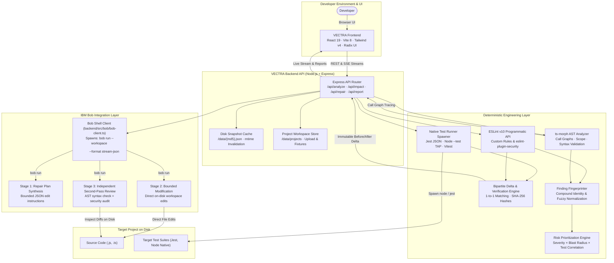

# VECTRA

<div align="center">


### Developer Workflow Platform for Autonomous Diagnosis, Bounded Repair, and Proof
**Built for the IBM Bob 2.0 Hackathon**

[](https://nodejs.org/)
[](https://react.dev/)
[](https://www.typescriptlang.org/)
[](https://vitejs.dev/)
[](https://tailwindcss.com/)
[](https://eslint.org/)
[](https://www.ibm.com/)
[](LICENSE)

<p align="center">
  <em>"Find the risk. Trace the cause. Fix with confidence."</em>
</p>

[Workflow](#-core-workflow) • [Architecture](#-architecture) • [Features](#-key-features) • [IBM Bob Integration](#-ibm-bob-integration) • [Quick Start](#-quick-start) • [Verification Proof](#-before--after-verification-proof) • [Tech Stack](#-technology-stack) • [Team](#-team)

</div>

---

## 💡 Overview

Modern developers face a broken debugging cycle: static analysis tools emit hundreds of disconnected warnings, call-graphs are opaque, AI assistants hallucinate unverified changes across files, and code is committed without proving whether fixes resolved issues or introduced regressions.

**VECTRA** is a developer workflow platform that unifies code diagnostics, blast-radius impact analysis, AI-assisted code repair, independent second-pass review, and test suite verification into one continuous, evidence-grounded pipeline:

$$\textbf{DISCOVER} \longrightarrow \textbf{DIAGNOSE} \longrightarrow \textbf{PRIORITIZE} \longrightarrow \textbf{TRACE IMPACT} \longrightarrow \textbf{REPAIR} \longrightarrow \textbf{REVIEW} \longrightarrow \textbf{VERIFY} \longrightarrow \textbf{PROVE}$$

Instead of treating AI code generation as an unguided black box, VECTRA combines **deterministic AST analysis and test execution** with **IBM Bob CLI (`bob run`) reasoning**:
1. **Deterministic Tools** pinpoint vulnerabilities, calculate call-graph blast radius, and execute the target project's real test suites.
2. **IBM Bob** synthesizes context to generate bounded file-edit plans, safely applies minimal on-disk modifications, and performs an independent secondary code review inspecting the resulting diff for regression risks.
3. **Verification Engine** re-runs the target suite (`npm test`, Jest, or `node --test`), validates AST elimination, and computes an immutable Before/After Delta Proof.

---

## 🔄 Core Workflow

VECTRA guides developers through eight systematic phases:

```
[ 1. DISCOVER ] ──► [ 2. DIAGNOSE ] ──► [ 3. PRIORITIZE ] ──► [ 4. TRACE IMPACT ]
                                                                      │
[ 8. PROVE ]    ◄── [ 7. VERIFY ]   ◄── [ 6. REVIEW ]     ◄── [ 5. REPAIR ]
```

1. **DISCOVER**: Scans the target project root without consuming AI tokens. Automatically detects language composition (JavaScript, TypeScript, mixed), frameworks (Express, Node.js), package manifests, entry points, and test file locations.
2. **DIAGNOSE**: Executes ESLint v10 flat-config programmatic analysis and `ts-morph` AST traversal alongside the project's native test runner. Discovers security anti-patterns (hardcoded secrets, object injection, unhandled promises, broad catch blocks), code quality risks, and failing test assertions.
3. **PRIORITIZE**: Computes a deterministic composite risk score ($0\text{–}100$) based on severity weighting, call-graph blast radius, and test failure correlation. Surfaces urgent blockers first.
4. **TRACE IMPACT**: Constructs AST call graphs to trace caller hierarchies, callee dependencies, affected files, and covering test suites for any selected finding. Identifies the precise blast radius before touching code.
5. **REPAIR**: Synthesizes finding context, line evidence, and impact boundaries into a structured brief. Invokes IBM Bob in headless mode (`bob run`) to produce an ordered, minimal repair plan and apply bounded modifications directly to files on disk.
6. **REVIEW**: An independent second-pass pass with strict reviewer instructions inspects the real file diff on disk. Validates JavaScript/TypeScript syntax and checks for security regressions, edge cases, and scope creep.
7. **VERIFY**: Re-executes the target project's actual test runner (`node --test`, Jest, or Vitest) and re-runs deterministic AST checks against the modified workspace.
8. **PROVE**: Computes a strict 1-to-1 bipartite delta proof comparing baseline and post-repair states. Verifies whether the targeted finding was resolved, tracks remaining defects, records test pass/fail deltas, and compiles an exportable Engineering Diagnostic Report.

---

## 🏛️ Architecture

VECTRA strictly separates **deterministic engineering tooling** from **AI reasoning**:



---

## 🤖 IBM Bob Integration

VECTRA was engineered specifically for the **IBM Bob 2.0 Hackathon**. Rather than using generic chatbots or mock API endpoints, VECTRA deeply integrates with the **IBM Bob Shell CLI (`bob run`)** to automate safe, transparent, and auditable code remediation.

### The Role of Bob in VECTRA

| Stage | Mode | Prompt Objective | Bob Action |
|---|---|---|---|
| **Stage 1: Plan** | Planning | Synthesizes finding evidence, affected lines, and call-graph blast radius into a structured JSON plan. | Emits ordered, minimal file-edit steps without modifying source files. |
| **Stage 2: Repair** | Agent Execution | Executes approved repair plan within target workspace boundaries. | Directly applies targeted edits to files on disk in the project directory. |
| **Stage 3: Review** | Independent Review | Evaluates actual on-disk diffs with adversarial reviewer instructions. | Assesses syntax validity, regression risks, and security vulnerabilities (`approved`, `concerns`, or `blocked`). |

### How VECTRA Interacts with IBM Bob

The integration is implemented in [`backend/src/bob/bob-client.ts`](file:///backend/src/bob/bob-client.ts) and follows strict constraints:

- **CLI-Native Execution**: Spawns `bob run` in headless, non-interactive mode with `--accept-license` and `--trust`.
- **Workspace Confinement**: Sets `-w <projectPath>` (`--workspace`) strictly to the target project directory. Bob never executes in the VECTRA platform root.
- **Structured Token Streaming**: Uses `--format stream-json` to capture live assistant tokens line-by-line and stream them to the frontend via Server-Sent Events (SSE).
- **Execution Safeguards**: Bounded by `--max-turns <n>` (default 15) and strict timeout protection (`timeoutMs: 60000`) to prevent runaway processes.
- **Secure Stdin Delivery**: Large prompts and source contexts are piped over `stdin` rather than passed as command-line arguments, preventing OS command buffer truncation on Windows and Linux.
- **Pre-Repair Baseline Snapshots**: Captures SHA-256 hashes of all target files before Bob edits them, enabling rollbacks and precise change tracking.
- **Graceful Degradation**: `isBobAvailable()` verifies CLI presence and `BOB_API_KEY` configuration. If unavailable, the UI presents an informative setup card while all local deterministic AST analysis and test execution features remain 100% operational.

> [!IMPORTANT]
> **Deterministic Analysis vs. AI Reasoning**:
> VECTRA never relies on LLMs for finding discovery, test runner counts, or verification metrics. All finding counts, test statuses (pass/fail), and delta numbers are computed deterministically by ESLint, `ts-morph`, and native test spawners. IBM Bob is applied strictly where AI excels: synthesizing context to write code, editing targeted files, and auditing diffs.

---

## ✨ Key Features

### 🔍 Whole-Project Discovery & Diagnostic Scanning
- Instant detection of project type, language breakdown, source files, and test files.
- Programmatic ESLint v10 analysis with custom security and code quality rules:
  - `vectra/no-hardcoded-secret`: Flags plaintext credentials and secrets.
  - `vectra/no-sql-concat`: Detects SQL injection vulnerabilities via concatenation.
  - `vectra/no-floating-async`: Flags unhandled asynchronous calls missing `await`.
  - `vectra/async-no-error-boundary`: Discovers async functions with multiple awaits lacking try/catch blocks.
  - `vectra/function-too-long`: Identifies monolithic functions exceeding maintainability thresholds.
  - `security/detect-object-injection`: Flags prototype pollution and dynamic key lookups.

### 🎯 Deterministic Risk Prioritization
- Combines static severity (`critical`, `high`, `medium`, `low`) with call-graph blast radius (affected callers/callees) and test suite failure correlation.
- Generates a transparent $0\text{–}100$ priority score so developers solve high-risk root causes first.

### 🧬 Stable Finding Fingerprints
- Eliminates stale finding references (e.g., `"Issue f_... not found"`) across edits.
- Generates normalized compound hashes: `ruleId::normalizedFilePath::normalizedTitleOrEvidence`.
- Multi-tier resolution matches issues across baseline snapshots, after-repair snapshots, repair records, and disk caches even when line numbers shift or caches are invalidated.

### 🌐 AST Call-Graph Impact Tracing
- Traverses AST symbol declarations and call hierarchies with `ts-morph`.
- Computes caller depth, direct vs. inferred relationships, and maps test suites covering the affected functions.

### 🛡️ Guarded Repair & Independent Review
- **Bounded Repair**: Pre-flight SHA-256 file hashing guarantees that only specified files are modified.
- **Deterministic Syntax Pre-Check**: Executes `new Function(code)` against repaired files before review to catch syntax breakages immediately.
- **Independent Second-Pass Review**: Bob re-inspects the modified diff on disk with a fresh context, acting as an impartial reviewer to flag regressions or security risks.

### 📊 Before/After Delta Proof & Verification
- Executes real target test suites (`node --test test/*.test.js`, `jest --json`, `vitest`).
- Implements strict 1-to-1 bipartite matching to correlate baseline findings with post-repair findings.
- Accurately proves whether a targeted defect was eliminated without reporting false positives or fictitious metrics.

### 📁 Project Import & Test Fixtures
- Supports uploading full project ZIP archives (up to 600 MB) with disk-backed streaming.
- Built-in Zip-Slip protection and automated exclusion of generated artifacts (`node_modules`, `.git`, `.dart_tool`, `dist`, `build`).
- Comes bundled with realistic test fixtures (`clean-project`, `risk-project`, and `sample-app`).

---

## 📸 Screenshots

| 1. Project Health & Verification Baseline | 2. 4-Stage Repair & Bob Workflow |
|:---:|:---:|
|  |  |
| *Initial diagnostic scan showing real test pass rates and baseline findings.* | *Interactive remediation workflow with IBM Bob connected.* |

| 3. IBM Bob Plan Generation | 4. Bounded Modification Applied |
|:---:|:---:|
|  |  |
| *Structured JSON repair plan synthesized by Bob from AST evidence.* | *Targeted code modification applied to file on disk.* |

| 5. Deterministic Verification & Delta Proof | 6. Accurate Persistence & Issue Status |
|:---:|:---:|
|  |  |
| *Re-executing test runner to mathematically verify resolution.* | *Truthful feedback when a defect persists despite passing tests.* |

---

## 🛠️ Technology Stack

| Layer | Technology | Version | Purpose |
|---|---|---|---|
| **Frontend UI** | [React](https://react.dev/) | `^19.2.8` | Component-driven user interface with React 19 concurrent features |
| **Frontend Build** | [Vite](https://vitejs.dev/) | `^8.3.0` | Next-generation dev server and bundler with HMR |
| **Frontend Types** | [TypeScript](https://www.typescriptlang.org/) | `~6.0.2` | Static typing with `verbatimModuleSyntax` |
| **Frontend Styling** | [Tailwind CSS](https://tailwindcss.com/) | `^4.3.3` | Modern dark-first utility CSS with `@tailwindcss/vite` |
| **Frontend Components** | [Radix UI](https://www.radix-ui.com/) | Latest | Accessible headless UI primitives (Dialog, Tooltip, Progress, ScrollArea) |
| **Frontend Icons** | [Lucide React](https://lucide.dev/) | `^1.48.0` | Consistent iconography across dashboards and workflows |
| **Frontend Linter** | [oxlint](https://oxc.rs/) | `^1.81.0` | Ultra-fast Rust-based JavaScript/TypeScript linter |
| **Backend Server** | [Express](https://expressjs.com/) | `^4.18.2` | Robust Node.js HTTP API server with CommonJS module structure |
| **Backend Language** | [TypeScript](https://www.typescriptlang.org/) | `^5.3.3` | Type-safe backend runtime compiled via `tsc` |
| **Dev Transpiler** | [ts-node-dev](https://github.com/wclr/ts-node-dev) | `^2.0.0` | Rapid development reloading with incremental transpilation |
| **Static Analysis** | [ESLint Programmatic API](https://eslint.org/) | `^10.11.0` | Programmatic flat-config analysis with custom AST security rules |
| **AST Traversal** | [ts-morph](https://ts-morph.com/) | `^28.0.0` | TypeScript Compiler API wrapper for call-graph & scope analysis |
| **Security Rules** | [eslint-plugin-security](https://github.com/eslint-community/eslint-plugin-security) | `^4.0.1` | Node.js security vulnerability scanning |
| **Archive Handling** | [adm-zip](https://github.com/cthack-0/adm-zip) / [multer](https://github.com/expressjs/multer) | `^0.6.1` / `^2.4.0` | Streaming multipart archive upload with traversal protection |
| **AI / Agent** | [IBM Bob CLI](https://www.ibm.com/) | CLI (`bob run`) | Headless autonomous agent for repair planning, editing, and review |
| **Unit Testing** | [Vitest](https://vitest.dev/) | `^1.2.0` | Fast unit test runner for VECTRA delta and analysis engines |
| **Demo Target Tests** | [Jest](https://jestjs.io/) | `^29.7.0` | Child-process test runner for sample-app verification |

---

## 📂 Repository Structure

```
VECTRA/
├── frontend/                          # React 19 + Vite 8 + Tailwind v4 Workspace
│   ├── src/
│   │   ├── components/                # UI components
│   │   │   ├── brand/                 # VECTRA brand & logos
│   │   │   ├── dashboard/             # Project summary, stats, issue list
│   │   │   ├── impact/                # Call-graph visualization components
│   │   │   ├── layout/                # AppLayout, Navbar, SplashScreen
│   │   │   ├── repair/                # RepairWorkflow, ReviewPanel, VerificationResult
│   │   │   └── ui/                    # Radix & Tailwind design primitives
│   │   ├── hooks/                     # Custom React hooks (useRepairWorkflow, useDashboard)
│   │   ├── lib/                       # API client (fetch & SSE stream reader), tokens, utils
│   │   ├── pages/                     # Dashboard, Issues, Impact, Repair, Verify, Report
│   │   └── types/                     # TypeScript domain models (mirrors backend)
│   ├── package.json
│   └── vite.config.ts
│
├── backend/                           # Express + TypeScript Analysis Server
│   ├── src/
│   │   ├── analysis/                  # Deterministic code intelligence
│   │   │   ├── ast-analyzer.ts        # ts-morph AST traversal & code metrics
│   │   │   ├── cache.ts               # mtime-based disk cache invalidation
│   │   │   ├── discover.ts            # Project layout, language & framework scan
│   │   │   ├── eslint-runner.ts       # ESLint v10 flat config & custom rule suite
│   │   │   ├── finding-lookup.ts      # Multi-tier resilient finding resolution
│   │   │   ├── fingerprint.ts         # Stable compound finding fingerprinting
│   │   │   ├── impact-tracer.ts       # Call-graph dependency tracer
│   │   │   ├── prioritizer.ts         # Deterministic priority scoring algorithm
│   │   │   └── test-runner.ts         # Test spawner (Jest JSON, Node TAP, Vitest)
│   │   ├── bob/                       # IBM Bob Shell CLI Integration
│   │   │   ├── bob-client.ts          # Process spawner (`bob run`), stream parser, timeout
│   │   │   ├── prompts.ts             # Bounded prompt templates for Plan, Edit, Review
│   │   │   ├── repair-workflow.ts     # Plan & edit orchestration
│   │   │   └── review-workflow.ts     # Syntax pre-check & secondary review pass
│   │   ├── report/                    # Reporting & proof engine
│   │   │   ├── delta.test.ts          # Bipartite matching unit tests (Vitest)
│   │   │   └── report-engine.ts       # Bipartite delta correlation & status derivation
│   │   ├── routes/                    # API endpoints (/analyze, /impact, /repair, /report, /project)
│   │   ├── types/                     # Canonical domain interfaces (Finding, Report, Delta)
│   │   └── index.ts                   # Express server bootstrap & middleware
│   ├── package.json
│   └── tsconfig.json
│
├── sample-app/                        # Deliberately Imperfect Demo Target
│   ├── src/                           # Express backend with realistic defects & secrets
│   ├── tests/                         # Jest test suite (16 passing, 2 failing)
│   └── package.json
│
├── test-fixtures/                     # Standalone Validation Fixtures
│   ├── clean-project/                 # Zero-finding passing reference project
│   ├── clean-project.zip              # Pre-packaged clean archive
│   ├── risk-project/                  # High-finding reference project
│   └── risk-project.zip               # Pre-packaged risk archive
│
├── test-artifacts/                    # Verified browser execution screenshots
├── data/                              # Runtime JSON cache & extracted projects (gitignored)
├── AGENTS.md                          # Repository instructions & constraints for agents
├── vectra-plan.md                     # Complete architectural design plan
└── package.json                       # Monorepo workspace scripts
```

---

## 🚀 Quick Start

### 1. Prerequisites

- **Node.js**: `v20.x` or higher (tested on Node v20+ and v25)
- **npm**: `v10.x` or higher
- **IBM Bob CLI** *(optional, for AI features)*: Installed and configured on your path (`bob --version`)

### 2. Installation

Clone the repository and install dependencies for all workspaces:

```bash
# Clone the repository
git clone https://github.com/Kathan-x/Vectra-The-Code-Doctor-.git
cd VECTRA

# Install root dependencies
npm install

# Install backend dependencies
cd backend && npm install && cd ..

# Install frontend dependencies
cd frontend && npm install && cd ..

# Install sample-app dependencies (demo target)
cd sample-app && npm install && cd ..
```

### 3. Environment Configuration

To enable IBM Bob's automated repair plan generation and independent review:

```bash
# Windows (PowerShell)
$env:BOB_API_KEY="<your-ibm-bob-api-key>"

# Windows (CMD)
set BOB_API_KEY=<your-ibm-bob-api-key>

# macOS / Linux
export BOB_API_KEY="<your-ibm-bob-api-key>"
```

> [!NOTE]
> If `BOB_API_KEY` is not set, VECTRA starts in **Deterministic Mode**. You can still execute whole-project scans, AST call-graph impact tracing, test executions, and manual verifications without an API key.

### 4. Running the Platform

From the repository root, start both backend and frontend concurrently:

```bash
npm run dev
```

This launches:
- **Backend API Server**: `http://localhost:3001` (with `ts-node-dev`)
- **Frontend Web UI**: `http://localhost:5173` (with Vite dev server & proxy)

Open **`http://localhost:5173`** in your browser.

---

## 🎯 Demo Walkthrough (Judge's Guide)

Follow this 3-minute guided evaluation flow:

### Step 1: Inspect the Baseline Dashboard
1. Navigate to `http://localhost:5173/dashboard`.
2. Notice the target project defaults to `sample-app` (or click **Switch Project** / **Upload ZIP** to import your own codebase).
3. Observe the deterministic breakdown:
   - **Total Findings**: Categorized by severity (Security, Bug, Quality, Async).
   - **Test Telemetry**: Real test results executed locally via child processes (e.g., *16 passing, 2 failing*).
   - **Scope Metrics**: Analyzed file counts and excluded directories.

### Step 2: Trace Call-Graph Impact
1. Navigate to **Issues** and select a high-priority finding (e.g., `Hardcoded secret in property "jwtSecret"` in `src/config.js`).
2. Click **Trace Impact** (or visit `/impact`).
3. View the interactive call graph: observe direct callers, callees, symbol definition, and the exact test suites covering that symbol.

### Step 3: Generate a Repair Plan with IBM Bob
1. Click **Repair with Bob** (or visit `/repair`).
2. If `BOB_API_KEY` is configured, click **Generate Repair Plan**.
3. Watch IBM Bob stream structured edit steps in real-time without moving or jumping the viewport.
4. Review the bounded plan (target file, line ranges, and risk estimation).

### Step 4: Apply Bounded Repair & Run Independent Review
1. Click **Apply Repair**.
2. VECTRA creates a pre-flight file snapshot and prompts Bob to make the exact change on disk.
3. Once applied, Stage 3 displays **Review Pending**. Click **Run Independent Review**.
4. Bob performs an adversarial secondary pass inspecting the real file diff on disk, validating JavaScript syntax and checking for regressions.

### Step 5: Verify & View the Delta Proof
1. Click **Run Verification Now** in Stage 4.
2. VECTRA re-runs the target project's real test runner (`npm test` / Jest) and re-analyzes AST findings.
3. Navigate to **Report** (`/report`) to inspect the final **Engineering Diagnostic & Proof Report**:
   - Before/After test pass rates.
   - Verified resolved findings vs. remaining issues.
   - Comprehensive audit trail with SHA-256 hashes and timestamped review outcomes.

---

## 🧪 Testing & Verification Strategy

VECTRA is tested using a multi-tiered verification strategy spanning unit tests, integration tests, and fixture validations:

### 1. Backend Unit Tests
Verifies bipartite delta computation, 1-to-1 finding matching, and edge-case handling:
```bash
cd backend
npx vitest run
```
*Current test suite: **6 passed** (`src/report/delta.test.ts`).*

### 2. Frontend Code Quality & Typecheck
Verifies strict TypeScript adherence and executes oxlint:
```bash
# Typecheck backend
cd backend && npx tsc --noEmit

# Typecheck frontend (React 19 + TypeScript 6)
cd frontend && npx tsc -b --noEmit

# Lint frontend with oxlint
cd frontend && npm run lint
```

### 3. Production Build Validation
Verifies that all workspaces compile cleanly:
```bash
npm run build
```
- Compiles backend TypeScript to CommonJS in `backend/dist/`.
- Compiles frontend TypeScript and creates optimized bundle in `frontend/dist/`.

### 4. Test Fixtures
- **`sample-app/`**: Realistic Express service with 10 deliberate security/quality defects and 18 Jest test assertions (16 pass, 2 fail).
- **`test-fixtures/clean-project/`**: Fully compliant zero-finding service with 100% test pass rate.
- **`test-fixtures/risk-project/`**: High-density vulnerability target for evaluating prioritizer accuracy and blast-radius tracking.

---

## 👥 Team

Built with dedication for the **IBM Bob 2.0 Hackathon**.

### Team Role Distribution

- **Kathan Patel** — Product Architecture & Integration • [GitHub](https://github.com/Kathan-x)
  - Full-stack system architecture, VECTRA 8-stage workflow orchestration, IBM Bob CLI headless adapter, deterministic AST & test runner integration, and end-to-end verification pipeline.
- **Heer** — Frontend & Workflow Experience • [GitHub](#)
  - User interface architecture, dashboard and repair workflow UX, Radix/Tailwind component polish, visual state transitions, and responsive testing.
- **Hetal** — Backend Analysis & Validation • [GitHub](#)
  - Static analysis engine integration, test fixture design, report schema validation, error boundary hardening, and documentation.

---

## 🏆 Hackathon Context

- **Event**: IBM Bob 2.0 Hackathon
- **Category**: Developer Workflow Platform
- **Core Mission**: Solving the pain points of fragmented debugging, unverified AI code generation, and regression risks in modern development teams.
- **Key Differentiator**: Combining deterministic local code intelligence with autonomous, bounded IBM Bob execution and verifiable Before/After Delta Proofs.

---

## 📄 License

This project is licensed under the MIT License — see the [LICENSE](LICENSE) file for details.
