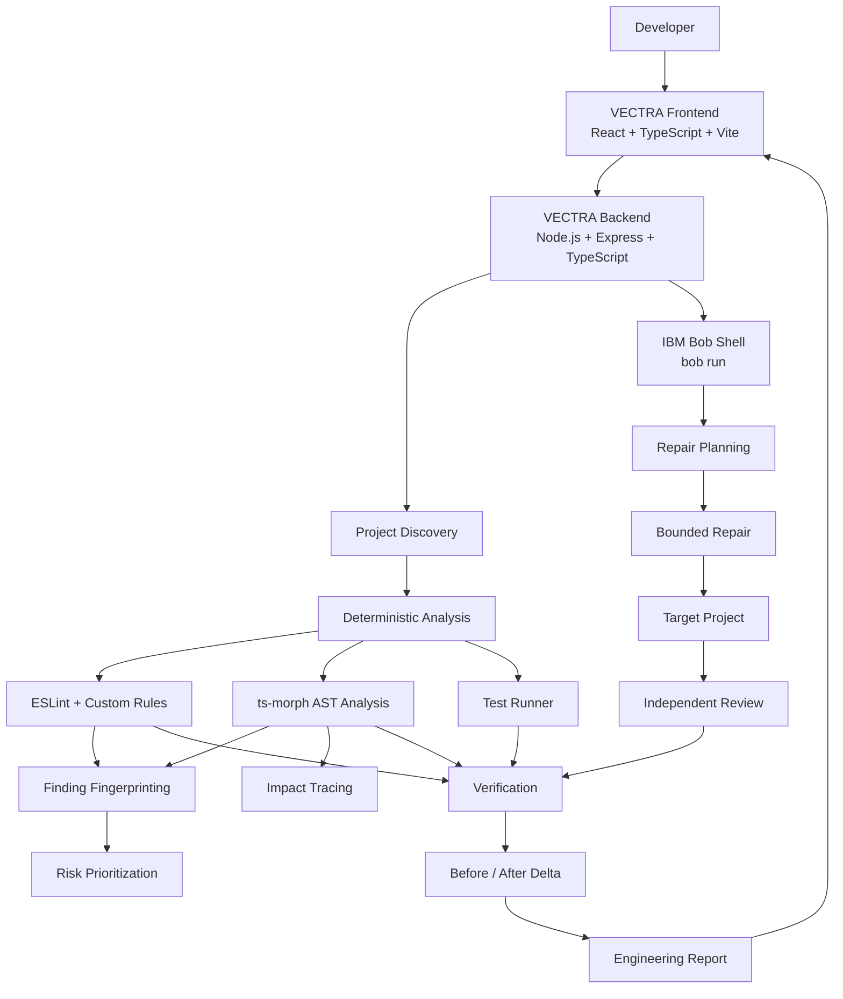

# VECTRA

<div align="center">

# VECTRA

### Software Engineering Intelligence & Guided Repair

**Find the risk. Trace the cause. Fix with confidence.**

Built for the **IBM Bob 2.0 Hackathon**

[](https://nodejs.org/)
[](https://react.dev/)
[](https://www.typescriptlang.org/)
[](https://vitejs.dev/)
[](https://eslint.org/)
[](https://www.ibm.com/)

</div>

---

## 🚀 What is VECTRA?

Modern software debugging is rarely a single step.

Developers often move between static analysis tools, source files, dependency tracing, test suites, AI coding assistants, code review, and deployment checks just to answer one question:

> **What is actually wrong, what does it affect, how should it be fixed, and did the fix really work?**

**VECTRA** brings this workflow into one developer-focused platform.

VECTRA combines:

- 🔍 Whole-project code analysis
- 🎯 Risk prioritization
- 🧬 AST-based impact tracing
- 🤖 IBM Bob-assisted repair
- 🔎 Independent repair review
- 🧪 Real test execution
- 📊 Before/after verification
- 📋 Engineering reports

Instead of treating AI-generated code changes as automatically correct, VECTRA creates an evidence-driven workflow around them.

---

## 🎯 Core Idea

VECTRA follows an eight-stage engineering workflow:

```text
DISCOVER
   ↓
DIAGNOSE
   ↓
PRIORITIZE
   ↓
TRACE IMPACT
   ↓
REPAIR
   ↓
REVIEW
   ↓
VERIFY
   ↓
PROVE
```

The goal is simple:

> **Find the risk. Trace the cause. Fix with confidence.**

---

# 🔄 Core Workflow

## 1. DISCOVER

VECTRA scans the target project and discovers:

- Source files
- Test files
- Package manifests
- Project structure
- Language composition
- Framework information
- Relevant project metadata

Project discovery is performed locally before AI-assisted repair is involved.

---

## 2. DIAGNOSE

The deterministic analysis layer examines the project using tools such as:

- ESLint
- Custom VECTRA rules
- `ts-morph`
- AST traversal
- Project test runners

It can identify categories such as:

- Security issues
- Bugs
- Async/reliability problems
- Code-quality issues
- Test-related problems

---

## 3. PRIORITIZE

VECTRA converts findings into prioritized issues.

The prioritization logic considers factors including:

- Finding severity
- Related findings
- Test failures
- Category
- Estimated impact

This allows developers to focus on important issues instead of treating every warning equally.

---

## 4. TRACE IMPACT

Before changing code, VECTRA can investigate the surrounding impact of a finding.

Using AST analysis, the platform can identify:

- Affected functions
- Callers
- Callees
- Related files
- Related test files
- Relationship confidence

The impact tracer uses bounded traversal rather than blindly traversing the entire dependency universe.

---

## 5. REPAIR

Once an issue is selected, VECTRA builds a repair context containing information such as:

- Finding details
- Source evidence
- Location
- Impact information
- Repair constraints

IBM Bob is then invoked to assist with the repair workflow.

The repair is performed against the selected target project workspace rather than the VECTRA platform itself.

---

## 6. REVIEW

After a repair, VECTRA can run an independent review pass.

The review checks the resulting change for issues such as:

- Syntax problems
- Regression risks
- Security concerns
- Edge cases
- Unnecessary changes
- Scope problems

This creates a second verification layer around the AI-assisted repair.

---

## 7. VERIFY

VECTRA re-runs the target project's supported test workflow and deterministic analysis.

Depending on the target project, the test infrastructure can work with:

- Jest
- Vitest
- Node.js native tests
- Project `npm test` scripts

The purpose is to verify the actual modified workspace rather than trusting the repair response.

---

## 8. PROVE

The report engine compares analysis snapshots before and after a repair.

It can track:

- Remaining findings
- Resolved findings
- Finding changes
- Test changes
- Verification state

VECTRA uses stable finding fingerprints and matching logic to reduce problems caused by generated issue IDs or small line-number changes.

---

# 🏗️ Architecture

VECTRA separates deterministic engineering analysis from AI-assisted reasoning.



---

# 🤖 IBM Bob Integration

IBM Bob is a core part of VECTRA's AI-assisted repair workflow.

VECTRA communicates with the **IBM Bob Shell CLI** through the backend.

The current Bob client uses:

```text
bob run
```

with a target project workspace and structured streaming output.

### Bob integration includes

- `BOB_API_KEY` environment-variable authentication
- Headless Bob CLI execution
- Target workspace control
- `--format stream-json`
- Bounded `--max-turns`
- Execution timeout protection
- Prompt delivery through standard input
- Streaming Bob output
- Graceful handling when Bob is unavailable

### Bob workflow

```text
VECTRA Finding
      ↓
Repair Context
      ↓
IBM Bob
      ↓
Repair Plan
      ↓
Targeted File Changes
      ↓
Independent Review
      ↓
VECTRA Verification
```

The Bob client is implemented in:

```text
backend/src/bob/bob-client.ts
```

The surrounding workflow is implemented through:

```text
backend/src/bob/
├── bob-client.ts
├── prompts.ts
├── repair-workflow.ts
└── review-workflow.ts
```

### API key security

The real API key must never be committed to Git.

Configure it locally using:

```text
BOB_API_KEY=<your-ibm-bob-api-key>
```

---

# 🧠 Deterministic Analysis + AI Reasoning

One of VECTRA's core design principles is separating deterministic engineering measurements from AI reasoning.

### Deterministic layer

VECTRA's local engineering layer is responsible for:

- Finding discovery
- Static analysis
- AST analysis
- Finding fingerprints
- Prioritization
- Impact tracing
- Test execution
- Verification
- Before/after comparison

### IBM Bob layer

IBM Bob is used for:

- Repair reasoning
- Repair planning
- Applying targeted changes
- Independent review

This separation means VECTRA does not need to ask an AI model to invent basic engineering measurements such as whether tests passed or how many findings were detected.

---

# ✨ Key Features

## 🔍 Whole-Project Discovery

VECTRA can analyze an imported project rather than restricting analysis to a single file.

The discovery system identifies relevant source and test files while excluding common generated directories.

---

## 🛡️ Security & Code Quality Analysis

The backend contains custom analysis rules for several classes of problems.

Examples include:

```text
no-sql-concat
no-hardcoded-secret
no-assign-in-condition
no-floating-async
function-too-long
```

The project also integrates `eslint-plugin-security`.

---

## 🎯 Risk Prioritization

Findings are categorized and scored using deterministic logic.

Severity categories include:

```text
Critical
High
Medium
Low
Info
```

The prioritizer also considers test relationships and other finding context.

---

## 🧬 Stable Finding Fingerprints

VECTRA contains a dedicated finding fingerprint system.

The fingerprinting layer normalizes information such as:

- Rule ID
- File path
- Finding title

This allows findings to be correlated across different analysis snapshots.

The implementation lives in:

```text
backend/src/analysis/fingerprint.ts
```

---

## 🌐 AST Impact Tracing

VECTRA uses `ts-morph` to inspect JavaScript and TypeScript source structure.

The impact tracer can identify:

- Function relationships
- Callers
- Callees
- Affected files
- Related tests

The traversal is bounded and excludes directories such as `node_modules`, `.git`, `dist`, `build`, and `coverage`.

---

## 🛠️ Guided Repair

VECTRA turns a finding into structured repair context before invoking IBM Bob.

This creates a controlled workflow rather than sending an isolated error message to an AI assistant.

---

## 🔎 Independent Review

After a repair is applied, VECTRA can invoke a separate Bob review workflow against the resulting project state.

The review focuses on whether the change introduced:

- Regressions
- Security issues
- Syntax problems
- Edge-case failures
- Unnecessary changes

---

## 🧪 Real Test Execution

The backend contains test-runner detection and parsers for supported project testing approaches.

Supported workflows include:

- Jest
- Vitest
- Node.js native tests
- `npm test`

Test results are converted into structured VECTRA test data.

---

## 📊 Before / After Verification

The report engine compares analysis snapshots and test results.

The verification system can distinguish between:

```text
Issue resolved
Issue persists
Partial improvement
Verification failed
Verification not performed
```

This is designed to prevent a repair from being marked successful simply because an AI assistant reported success.

---

## 📦 Project Import

VECTRA supports ZIP project imports.

The project import route includes:

- Disk-backed upload handling
- ZIP validation
- Generated-directory exclusion
- Temporary workspace handling
- Project metadata discovery
- ZIP Slip path traversal protection

The configured upload limit is **600 MB**.

---

# 🧪 Demo Projects

The repository contains projects specifically designed to exercise VECTRA.

## `sample-app`

A deliberately imperfect Node.js + Express application used as the primary demonstration target.

It contains intentional issues across areas such as:

- Authentication logic
- SQL query construction
- Configuration/security
- Data processing
- Async handling
- Date formatting

It also contains Jest tests designed to exercise both working and problematic behavior.

---

## `test-fixtures/clean-project`

A small reference project intended to validate clean analysis behavior.

---

## `test-fixtures/risk-project`

A deliberately risky project used to validate:

- Finding discovery
- Prioritization
- Impact analysis
- Test relationships

---

# 📂 Repository Structure

```text
VECTRA/
│
├── frontend/
│   └── src/
│       ├── components/
│       │   ├── brand/
│       │   ├── dashboard/
│       │   ├── impact/
│       │   ├── issue/
│       │   ├── layout/
│       │   ├── project/
│       │   ├── repair/
│       │   └── ui/
│       │
│       ├── hooks/
│       ├── lib/
│       ├── pages/
│       └── types/
│
├── backend/
│   └── src/
│       ├── analysis/
│       │   ├── ast-analyzer.ts
│       │   ├── cache.ts
│       │   ├── discover.ts
│       │   ├── eslint-runner.ts
│       │   ├── finding-lookup.ts
│       │   ├── fingerprint.ts
│       │   ├── impact-tracer.ts
│       │   ├── prioritizer.ts
│       │   └── test-runner.ts
│       │
│       ├── bob/
│       │   ├── bob-client.ts
│       │   ├── prompts.ts
│       │   ├── repair-workflow.ts
│       │   └── review-workflow.ts
│       │
│       ├── report/
│       ├── routes/
│       ├── scripts/
│       ├── types/
│       └── index.ts
│
├── sample-app/
│   ├── src/
│   ├── tests/
│   └── package.json
│
├── test-fixtures/
│   ├── clean-project/
│   ├── clean-project.zip
│   ├── risk-project/
│   └── risk-project.zip
│
├── .bob/
├── AGENTS.md
├── vectra-plan.md
├── package.json
└── README.md
```

---

# 🛠️ Technology Stack

| Layer | Technology | Purpose |
|---|---|---|
| Frontend | React | Application UI |
| Frontend Language | TypeScript | Type-safe frontend |
| Build Tool | Vite | Development and production builds |
| Styling | Tailwind CSS | UI styling |
| UI Primitives | Radix UI | Accessible components |
| Icons | Lucide React | Interface icons |
| Frontend Linting | oxlint | JS/TS linting |
| Backend | Node.js | Server runtime |
| API | Express | REST API |
| Backend Language | TypeScript | Type-safe backend |
| Static Analysis | ESLint | Code analysis |
| AST Analysis | ts-morph | Source-code structure analysis |
| Security Rules | eslint-plugin-security | Security-oriented analysis |
| AI Integration | IBM Bob Shell | Repair and review |
| Backend Testing | Vitest | VECTRA backend tests |
| Demo Testing | Jest | Sample application tests |
| Archive Processing | Multer + adm-zip | Project import |

---

# 🌐 Backend API

The VECTRA backend exposes API routes for the major workflow stages.

### Health

```text
GET /api/health
```

### Analysis

```text
POST /api/analyze
GET  /api/analyze/status
```

### Impact

```text
GET  /api/impact/:issueId
POST /api/impact
```

### Repair & Review

```text
GET  /api/repair/status
POST /api/repair/plan
POST /api/repair/run
POST /api/repair/review
POST /api/repair/verify
```

### Reports

```text
GET  /api/report
POST /api/report/generate
```

### Project Management

```text
GET  /api/project/default
POST /api/project/import
```

---

# 🚀 Quick Start

## Prerequisites

Install:

- Node.js 20+
- npm
- IBM Bob CLI for AI-assisted repair features

Check Node:

```bash
node --version
```

Check npm:

```bash
npm --version
```

Check Bob:

```bash
bob --version
```

---

## 1. Clone the repository

```bash
git clone https://github.com/Kathan-x/Vectra-The-Code-Doctor-.git
cd VECTRA
```

---

## 2. Install dependencies

From the repository root:

```bash
npm install
```

Then install workspace dependencies:

```bash
cd backend
npm install
cd ..
```

```bash
cd frontend
npm install
cd ..
```

```bash
cd sample-app
npm install
cd ..
```

---

## 3. Configure IBM Bob

### PowerShell

```powershell
$env:BOB_API_KEY="<your-ibm-bob-api-key>"
```

### Windows CMD

```cmd
set BOB_API_KEY=<your-ibm-bob-api-key>
```

### macOS / Linux

```bash
export BOB_API_KEY="<your-ibm-bob-api-key>"
```

Never commit the real key.

---

## 4. Start VECTRA

From the repository root:

```bash
npm run dev
```

The root development script starts the backend and frontend together.

The backend runs on:

```text
http://localhost:3001
```

The Vite frontend normally runs on:

```text
http://localhost:5173
```

Open the frontend URL in your browser.

---

# 🧪 Testing & Validation

## Backend tests

```bash
cd backend
npm test
```

This runs the backend Vitest suite.

---

## Backend typecheck

```bash
cd backend
npx tsc --noEmit
```

---

## Frontend build

```bash
cd frontend
npm run build
```

---

## Frontend lint

```bash
cd frontend
npm run lint
```

---

## Full production build

From the repository root:

```bash
npm run build
```

This builds the backend and frontend.

---

## Sample application tests

```bash
cd sample-app
npm test
```

For verbose Jest output:

```bash
npm run test:verbose
```

---

# 🎬 Recommended Demo Flow

For a short VECTRA demonstration:

```text
1. Launch VECTRA
        ↓
2. Select the demo project
        ↓
3. Run analysis
        ↓
4. Inspect prioritized findings
        ↓
5. Open an important issue
        ↓
6. Trace its impact
        ↓
7. Generate a repair plan with IBM Bob
        ↓
8. Apply the repair
        ↓
9. Run independent review
        ↓
10. Run verification
        ↓
11. Inspect the before/after result
```

This demonstrates the complete VECTRA workflow rather than showing only an isolated AI-generated code change.

---

# 🧩 Engineering Principles

## Evidence Before Action

VECTRA attempts to understand the issue and its impact before modifying the target code.

## AI With Boundaries

IBM Bob is used for contextual reasoning and repair while deterministic tooling remains responsible for analysis and verification.

## Real Verification

A repair should not be considered successful simply because an AI agent says it worked.

The modified project should be analyzed and tested again.

## Traceability

The workflow maintains information about findings, repair operations, review results, and verification state so the developer can understand what happened.

---

# 👥 Team & Contributions

VECTRA was developed by a three-person team for the **IBM Bob 2.0 Hackathon**.

The following describes the team's functional contribution areas.

### Kathan Patel
**Product Architecture & Full-Stack Integration**

- Overall VECTRA architecture
- Frontend/backend integration
- Core developer workflow
- IBM Bob CLI integration
- Analysis pipeline integration
- Repair workflow orchestration
- Verification and reporting integration
- Project integration and GitHub repository management

GitHub:  
https://github.com/Kathan-x

---

### Heer
**Frontend & User Experience**

- Frontend workflow experience
- Dashboard and issue interfaces
- Repair/review workflow UI
- Component-level UI development
- User interaction and usability refinement
- Visual presentation and demo experience

GitHub:  
https://github.com/Heerrr166
---

### Hetal
**Backend Analysis, Testing & Validation**

- Backend workflow support
- Analysis and validation workflows
- Test fixture validation
- Testing and verification support
- Report/workflow validation
- Documentation and presentation support

GitHub:  
https://github.com/hetal-malviya

> **Note:** These are team role/contribution areas. GitHub commit authorship remains associated with the accounts that actually created each commit.

---

# 🏆 IBM Bob 2.0 Hackathon

VECTRA was created for the **IBM Bob 2.0 Hackathon** with the goal of improving a developer workflow.

The project focuses on the intersection of:

- Debugging
- Code analysis
- Testing
- Application maintenance
- Guided repair
- Code review

The central idea is to combine deterministic engineering analysis with IBM Bob's agent capabilities while keeping the final repair process measurable and verifiable.

---

# 🔮 Future Improvements

Potential future directions include:

- Additional programming language support
- More test-runner integrations
- Deeper dependency analysis
- Pull-request integration
- CI/CD integration
- Historical project intelligence
- Team collaboration features
- Additional automated repair strategies

These are future directions and are not presented as current functionality.

---

# 🔐 Security

Never commit credentials or API keys.

For IBM Bob, configure:

```text
BOB_API_KEY=<your-api-key>
```

Do not place the real key in:

- Source code
- README files
- Public screenshots
- Git commits
- Public configuration files

The repository's `.gitignore` excludes local environment files and runtime data.

---

# 📌 Project Status

VECTRA is a hackathon prototype demonstrating an integrated developer workflow for:

```text
Code Analysis
     ↓
Risk Prioritization
     ↓
Impact Tracing
     ↓
AI-Assisted Repair
     ↓
Independent Review
     ↓
Test Verification
     ↓
Before / After Proof
```

The repository includes the VECTRA platform, a deliberately imperfect demo application, and dedicated test fixtures for validating the analysis workflow.

---

<div align="center">

## VECTRA

**Find the risk. Trace the cause. Fix with confidence.**

Built with React, TypeScript, Node.js, deterministic code analysis, and IBM Bob.

</div>
